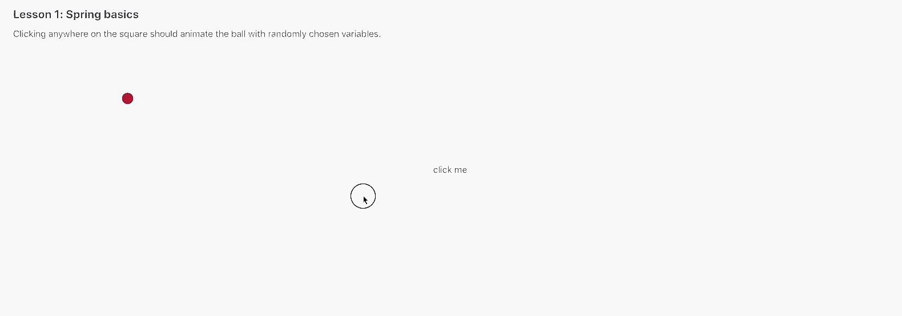

# react-spring workshop: learn by building animations

## How to get started

1. Run `yarn` and `yarn start`
2. Navigate to `src/1-animating-with-springs/README.md`. (It's suggested to view the README.md files for each lesson in a markdown interpreter for a better experience and to avoid getting potentially spoiled by seeing hints before you need them.)
3. Complete the tasks specified in the README by editing the index.js file. You will only need to write code in places specified by the `TODO` placeholder comments.
4. Later tasks build on earlier ones, so please complete them in order.

## Lessons

### 1. Spring basics



### 2. Staggered springs


### 3. Enter and exit


## Some initial thoughts

### When to use a JS library over a CSS library?

First, make sure you understand how to use:

### CSS transitions

Which simply transition between 2 pre-existing values

```css
.example {
  opacity: 0.9;
  transition: opacity 0.25s;
  &:hover {
    opacity: 1;
  }
}
```

#### CSS keyframes

Which animate between 2 values, a classic use is adding a fade-in effect for newly mounted elements:

```css
@keyframes fadeIn {
  0% {
    opacity: 0;
  }
  100% {
    opacity: 1;
  }
}

.some-element {
  animation: fadeIn 0.25s forwards;
}
```

CSS has a lot of advantages like potential performance benefits when used correctly, ease of use, and a lack of state that causes animations to get out of sync. But there are reasons you would waant to look towards using JS instead.

### Some questions to ask to see if it's worth to JS:

- Does the animation respond to user input more complex than a hover or a click (e.g. drag, press, etc)? JS is often better for this.
- Do you want the more expressive look of springs instead of hardcoded easings (like `ease-in`)?
- Is the animation complex? Are there multiple animations that take place in sequence?
- Do you have multiple elements staggering movement? JS is better for this.
- Is the animation interruptible? JS might yield a more natural look.
- Are you animating values other than opacity? (Opacity can usually take a hardcoded CSS tween).

### Springs vs tweens

- Self-link alert: [my talk on mobile animations goes over this at more length](https://github.com/aholachek/mobile-first-animation)

### react-spring is not magic!

(Although it's great...)

You could use many other libraries to achieve the exact same effects as react-spring, or even roll your own with [a tiny spring simulator library](https://github.com/skevy/wobble).

I've learned this the hard way: don't just try random stuff and hope that things look ok, break animations down into intentional bite-size pieces.
